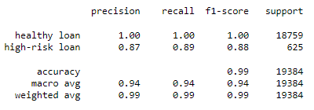
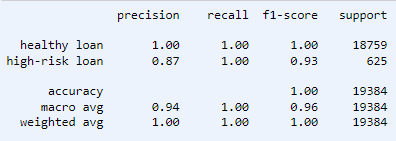

# Credit-risk classification

## Analysis overview

This was an analytical exercise on supervised machine learning (ML) models to determine the creditworthiness of borrowers. The dataset used in this analysis included historical
record of lending activities from a peer-to-peer lending service company. The main purpose of the work  was to build, train and test various supervised ML models to predict the
status of a borrower as either a "healthy loan" or a "high-risk loan".

## Results

* The csv dataset was first imported into the Pandas dataframe. Then the "loan status" column was assigned as y and the rest were assigned as X. To obtained the unique record, 
y.value_counts() was used. The dataset was then split into train and test sets using the train_test_split module of sklearn.
* As model 1, LogisticRegression was instantiated from the sklearn.linear_model module. The classification report shows us the following information:

From the report, we see that precision, recall and f1-score for healthy loans using the LogisticRegression model are all 100%, however, for the high-risk loans, these accuracies
range from 87% to 89%.

* As model 2, RandomOverSampler is used to up sample the training data. And using this resampled data, the same LogisticRegression model is instantiated. The following report is
now generated.

Here we see that the precision remained the same, recall improved to 100% and f1-score improved to 93%. 

## Summary

We see that Model 2 shows better accuracies as it is able to detect the high-risk loans better than the previous model while also detecting the healthy loans with 100% accuracy. 
Therefore, we can recommend Model 2. I think it is also important to detect the high-risk loans with good accuracy in order to avoid financial loss.
